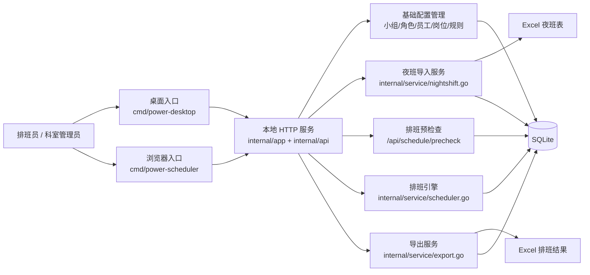
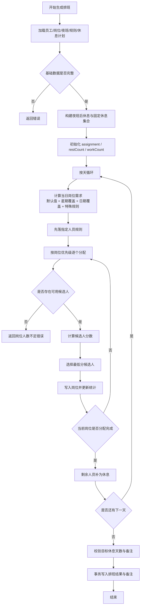

# 医院检验科排班系统实施方案

## 1. 文档目标

本文档用于说明当前排班系统的建设思路、技术架构、核心数据模型、排班算法和实施边界，作为开发、交付、培训和后续迭代的统一参考。

适用范围：

- 医院检验科按小组排班
- 单机部署、本地数据存储
- 夜班由外部 Excel 维护后导入
- 日班由系统按规则自动生成

## 2. 建设目标

### 2.1 业务目标

- 提供一个可在 Windows 本地运行的排班工具
- 支持小组、员工、角色、岗位、规则的配置维护
- 支持夜班导入和夜班后休息自动约束
- 支持按月份自动生成日班排班结果
- 支持排班结果导出和备注留痕

### 2.2 系统目标

- 部署简单，无需独立数据库服务
- 页面操作尽量直观，适合科室排班人员使用
- 排班逻辑以硬约束优先，确保结果可落地
- 为后续规则扩展、算法优化和测试补充预留结构

## 3. 当前技术方案

### 3.1 技术选型

- 后端：Go
- Web 框架：Gin
- ORM：GORM
- 数据库：SQLite
- 前端：原生 HTML / CSS / JavaScript
- 桌面封装：Lorca
- Excel 处理：excelize
- 安装包：NSIS

### 3.2 选型说明

- SQLite 适合单机部署，维护成本低
- Gin + GORM 开发效率较高，便于快速迭代业务接口
- 静态前端部署简单，和本地服务耦合度低
- Lorca 可以快速提供桌面窗口，适合当前轻量桌面化需求

## 4. 总体架构

### 4.1 架构说明

系统由桌面入口或浏览器入口访问本地 HTTP 服务，服务层负责基础数据管理、夜班导入、排班预检查、排班生成与导出，所有业务数据持久化到本地 SQLite。

### 4.2 架构图

## 5. 核心业务模型

### 5.1 主要实体

- `Group`：科室下的小组
- `RoleOption`：角色配置，支持“允许少休”标记
- `Employee`：员工基础信息，支持多角色和夜班资格
- `ShiftPost`：岗位定义和默认需求人数
- `PostDailyRequirement`：按日期覆盖岗位需求
- `PostWeekdayRequirement`：按星期覆盖岗位需求
- `SpecialRule`：指定岗位人数或指定人员值岗
- `NightShiftRecord`：夜班导入记录
- `MonthlyConstraint`：角色级月度休息目标
- `EmployeeRestPlan`：员工个人休息计划
- `ScheduleEntry`：排班结果
- `ScheduleRemark`：跨月、欠休等备注
- `RestDebtRecord`：休息欠账记录

### 5.2 数据关系摘要

- 一个小组对应多个角色、员工、岗位和规则
- 员工属于单个小组，但可拥有多个角色
- 岗位需求可被星期规则或日期规则覆盖
- 夜班记录与排班结果通过月份串联
- 排班结果和备注按“小组 + 月份”维度持久化

## 6. 排班规则设计

### 6.1 硬约束

以下约束必须满足，否则排班失败：

- 目标月份必须存在夜班数据
- 小组必须存在启用状态员工
- 小组必须存在启用状态岗位
- 夜班人员必须在员工名单中且具备夜班资格
- 夜班后休息日不能再排日班
- 固定休息日不能再排岗位
- 每人每天只能分配一个结果
- 每个岗位当日必须满足需求人数
- 对于不允许少休的员工，实际休息天数不能低于目标值

### 6.2 软约束

在不破坏硬约束的前提下，系统尽量做到：

- 休息天数接近个人目标
- 周末休息分配更均衡
- 工作量分配更均衡
- 特殊规则优先满足

### 6.3 跨月处理

- 当前月夜班的后续休息可延伸到下月
- 上月末夜班的延续休息会自动映射到本月
- 相关信息写入 `ScheduleRemark`，便于导出和追溯

## 7. 排班算法设计

### 7.1 算法思路

当前实现偏向“可解释的启发式排班”，而不是复杂求解器：

1. 先加载基础数据、夜班记录、规则和休息计划。
2. 先把夜班后休息、固定休息等强制不可排日写入结果。
3. 对每天按岗位优先级依次分配人员。
4. 在候选员工中使用评分函数选择更合适的人。
5. 未分配岗位的员工再补齐为普通休息。
6. 最终校验休息目标和跨月备注，写入数据库。

### 7.2 候选人评分逻辑

当前评分主要基于以下维度：

- 已工作天数越多，分值越高，优先级越低
- 与目标休息天数差距越大，越倾向继续安排休息
- 周末休息较少的人，在周末更容易被优先保留休息

这类策略能够在保证规则落地的前提下，尽量避免个别人过劳或周末休息明显失衡。

### 7.3 算法流程图

### 7.4 算法优点与局限

优点：

- 规则逻辑清晰，便于业务解释
- 实现简单，适合快速迭代
- 对单机规模的检验科排班足够轻量

局限：

- 对复杂冲突的全局最优能力有限
- 缺少自动回溯和多轮优化
- 目前仍以“生成成功”优先，公平性优化空间较大

## 8. 功能模块划分

### 8.1 基础配置模块

- 小组管理
- 角色管理
- 员工管理
- 专业管理
- 岗位管理

### 8.2 规则配置模块

- 角色月度休息目标
- 个人休息计划
- 特殊规则
- 岗位星期需求
- 岗位日期需求

### 8.3 夜班与排班模块

- 夜班导入
- 排班预检查
- 自动生成排班
- 查看备注说明

### 8.4 导出模块

- 月度排班 Excel 导出
- 备注说明导出

## 9. 部署与交付

### 9.1 运行方式

- 服务版：启动 `cmd/power-scheduler`
- 桌面版：启动 `cmd/power-desktop`

### 9.2 本地存储

- 数据库文件：`data/scheduler.db`
- 前端静态资源：`web/`

### 9.3 打包方式

- 编译 `power-scheduler.exe` 和 `power-desktop.exe`
- 复制 `web/` 目录到分发目录
- 使用 NSIS 生成 `PowerSchedulerSetup.exe`

## 10. 风险与改进建议

### 10.1 当前风险

- 接口和错误文案存在历史编码问题
- `scripts/` 目录影响 `go test ./...`
- 排班算法缺少单元测试与回归测试
- 夜班导入暂不支持更复杂的节假日差异规则

### 10.2 建议迭代方向

- 统一项目编码和文案
- 将脚本从主模块测试路径中隔离
- 增加排班样例数据和自动化测试
- 引入更强的冲突解释与排班回溯能力
- 视复杂度引入求解器或二次优化策略
