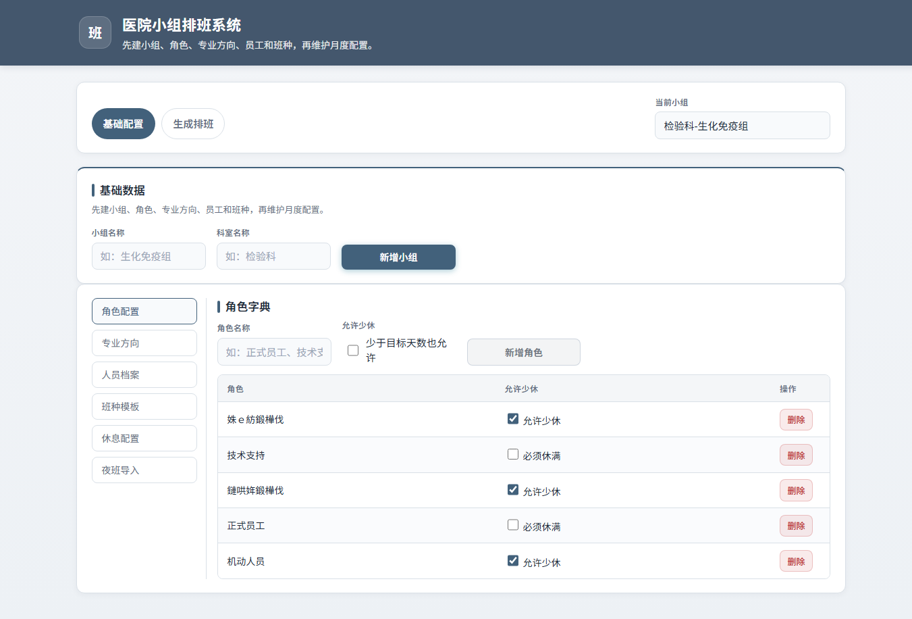
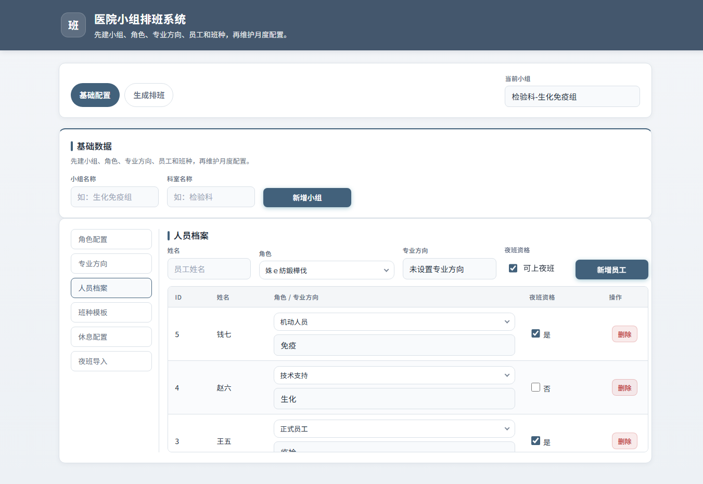
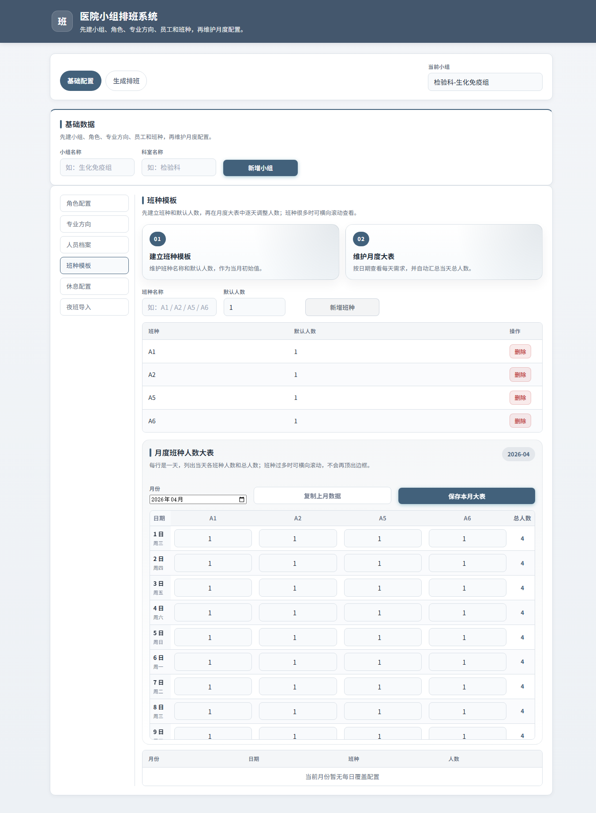
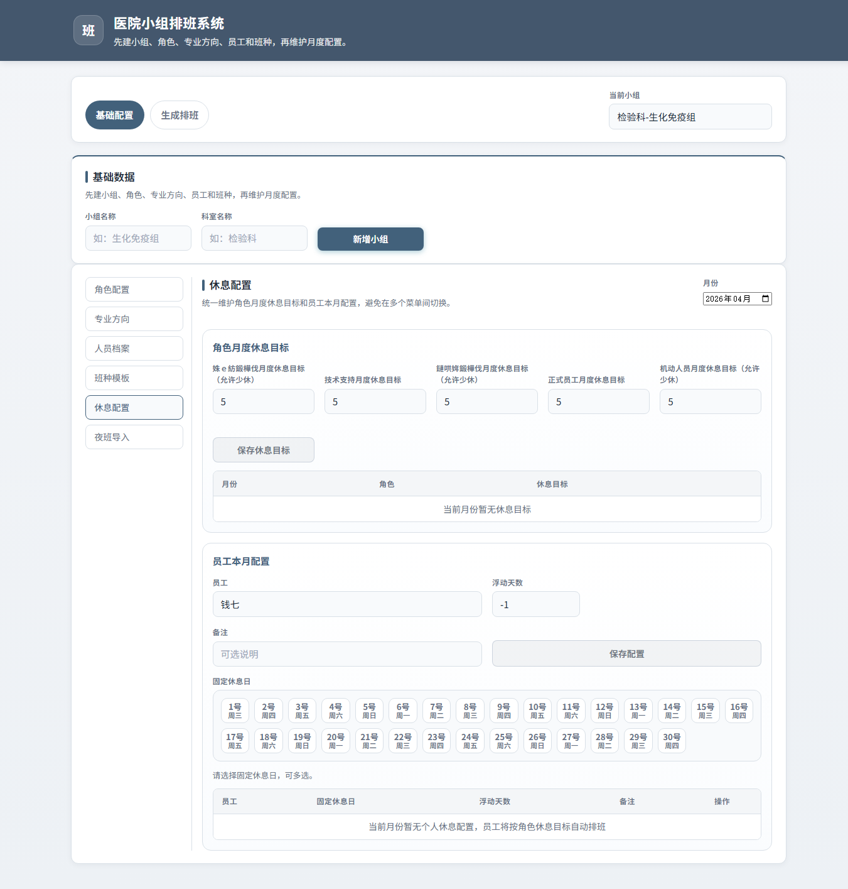
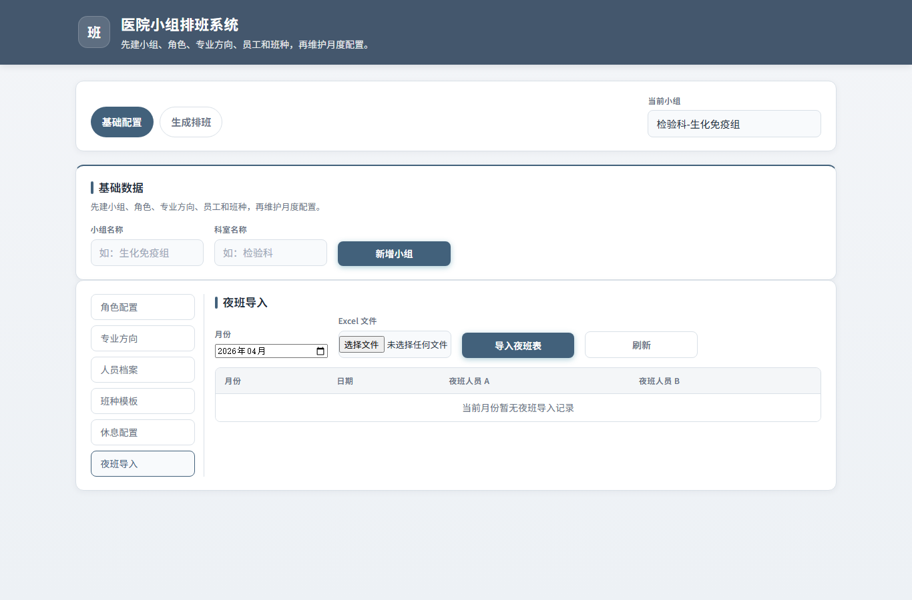
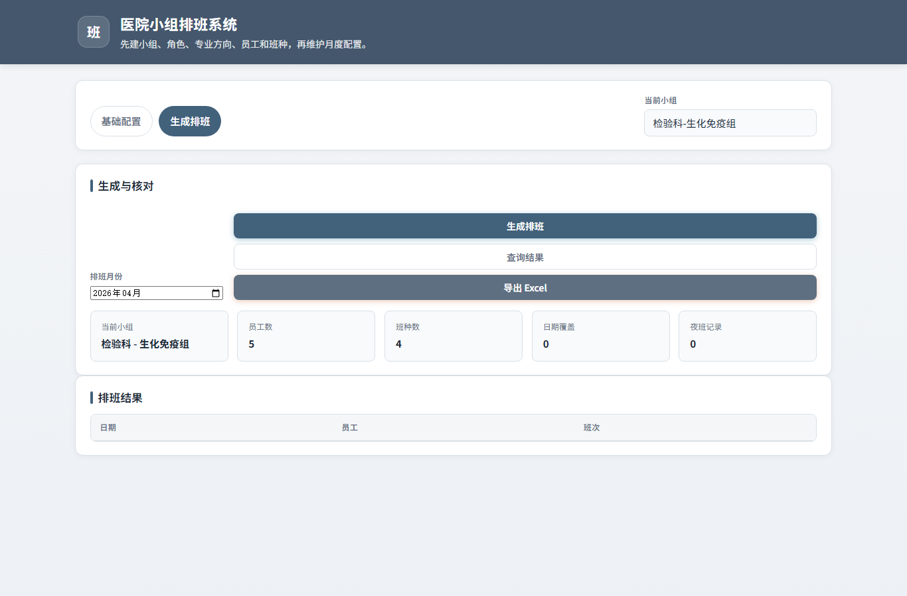

# 医院检验科排班系统操作手册

适用对象：检验科、各专业组排班负责人、科室管理人员。  
本文按日常操作顺序编写，不需要了解程序开发知识。

> 文档中的截图使用演示数据，仅用于说明按钮位置和填写方式；实际使用时请以本科室人员、班种和月份为准。

## 1. 安装与启动

### 1.1 安装文件位置

仓库中已经放置 Windows 安装包：

- 安装包：`releases/PowerSchedulerInstaller.exe`
- 校验文件：`releases/PowerSchedulerInstaller.sha256.txt`

### 1.2 安装步骤

1. 双击 `PowerSchedulerInstaller.exe`。
2. 安装器会自动安装到当前用户目录：`%LOCALAPPDATA%\PowerScheduler`。
3. 安装完成后，桌面和开始菜单会出现 `PowerScheduler` 快捷方式。
4. 安装器会尝试自动启动系统；以后也可以双击桌面 `PowerScheduler` 启动。

### 1.3 启动说明

正常情况下，系统会打开一个桌面窗口。若电脑缺少可用的 Chromium/Chrome 内核，系统会自动退回到浏览器方式打开。

系统数据保存在当前用户目录下：

`%LOCALAPPDATA%\PowerScheduler\data\scheduler.db`

建议每次正式排班前，把这个文件复制一份作为备份。

## 2. 日常排班流程总览

推荐每月按下面顺序操作：

1. 建立或选择小组。
2. 维护角色、专业方向、人员档案。
3. 维护班种模板和本月每日班种人数。
4. 维护本月休息目标和个人休息配置。
5. 导入本月夜班表。
6. 生成排班。
7. 查询结果、核对备注、导出 Excel。

## 3. 基础数据配置

### 3.1 新增小组

位置：顶部 `基础配置` 页签，下方 `基础数据` 区域。

填写：

- `小组名称`：例如 `生化免疫组`
- `科室名称`：例如 `检验科`

填写后点击 `新增小组`。新增成功后，右上角 `当前小组` 会显示刚创建的小组。

注意：一个系统可以维护多个小组，操作前先确认右上角选中的小组是否正确。

### 3.2 角色配置

位置：左侧菜单 `角色配置`。

角色用于设置不同人员的休息目标和排班规则，例如：

- 正式员工
- 技术支持
- 机动人员

填写 `角色名称` 后点击 `新增角色`。

`允许少休` 的含义：如果某类人员本月确实无法休满目标天数，勾选后系统允许生成排班；未勾选时，系统会更严格地要求休满目标。

### 3.3 专业方向

位置：左侧菜单 `专业方向`。

用于标记员工所在方向，例如：

- 生化
- 免疫
- 临检
- 微生物

填写方向名称后点击 `新增专业方向`。

## 4. 人员档案

位置：左侧菜单 `人员档案`。

新增人员时需要填写：

- `姓名`：员工姓名。
- `角色`：可选择一个或多个角色。
- `专业方向`：选择该员工所属方向。
- `夜班资格`：能上夜班则勾选，不能上夜班则取消勾选。

填写完成后点击 `新增员工`。

注意事项：

- 人员姓名需要与夜班 Excel 中的姓名保持一致。
- 删除员工前请确认该员工不再参与后续排班。
- 如果员工临时不参与排班，当前界面暂未提供停用按钮，建议先不要删除历史人员，必要时由管理员处理数据库备份后再调整。

## 5. 班种模板与本月人数大表

位置：左侧菜单 `班种模板`。

### 5.1 新增班种

在 `班种名称` 中填写班种，例如：

- A1
- A2
- A5
- A6

在 `默认人数` 中填写该班种平时每天需要几人，然后点击 `新增班种`。

### 5.2 维护本月每日人数

在 `月度班种人数大表` 中选择月份。系统会按当月日期列出每天的各班种人数。

操作方法：

1. 选择月份。
2. 检查每一天、每个班种的人数。
3. 如遇节假日、周末或特殊工作日，直接修改对应日期的数字。
4. 修改完成后点击 `保存本月大表`。

`总人数` 列用于快速检查当天排班需求是否过高。

### 5.3 复制上月数据

如果本月排班需求与上月类似，可点击 `复制上月数据`。

注意：复制上月数据会清空本月已有配置，再写入上月配置。点击前请确认本月数据不再需要保留。

## 6. 休息配置

位置：左侧菜单 `休息配置`。

### 6.1 设置角色月度休息目标

先选择月份，然后为每个角色填写本月目标休息天数。例如：

- 正式员工：5 天
- 技术支持：5 天
- 机动人员：5 天

填写后点击 `保存休息目标`。

### 6.2 设置员工本月特殊休息

如果某位员工本月有明确休息日或额外说明，可在右侧 `员工本月配置` 中维护。

填写：

- `员工`：选择人员。
- `固定休息日`：点击日期按钮，可多选。
- `浮动天数`：
  - `-1` 表示按角色目标自动处理。
  - `0` 或正数表示手动指定本月还需要安排的浮动休息天数。
- `备注`：填写原因，例如 `进修`、`产检`、`外出学习`。

填写后点击 `保存配置`。

## 7. 夜班导入

位置：左侧菜单 `夜班导入`。

### 7.1 Excel 格式要求

夜班表建议使用 Excel 第一张工作表，表头示例：

| 日期 | 夜班A | 夜班B |
| ---- | ---- | ---- |
| 1 | 张三 | 李四 |
| 2 | 王五 | 赵六 |

也可以把两个人写在第二列中，用 `、`、`,`、`/`、`|` 分隔，例如：

| 日期 | 夜班人员 |
| ---- | ---- |
| 1 | 张三、李四 |

系统要求每一天夜班必须是两个人。姓名必须与 `人员档案` 中的姓名一致。

### 7.2 导入步骤

1. 选择 `月份`。
2. 点击 `Excel 文件`，选择本月夜班表。
3. 点击 `导入夜班表`。
4. 导入成功后，下方表格会显示夜班记录。

注意：重复导入同一个月份时，系统会先删除该月份已有夜班记录，再导入新文件。

## 8. 生成排班

位置：顶部 `生成排班` 页签。

### 8.1 生成前检查

生成前请确认：

- 右上角 `当前小组` 正确。
- `排班月份` 正确。
- 员工数、班种数、日期覆盖、夜班记录数量符合预期。
- 休息目标已经保存。
- 班种人数大表已经保存。
- 夜班表已经导入。

### 8.2 生成步骤

1. 选择 `排班月份`。
2. 点击 `生成排班`。
3. 系统会弹出确认框，列出当前小组、月份、员工数、班种数、特殊规则数、夜班记录数。
4. 确认无误后点击 `确定`。
5. 系统先做预检查，如果人数不足，会提示需要先调整班种人数或人员配置。
6. 通过预检查后，系统生成本月排班结果。

注意：同一小组、同一月份重新生成时，会覆盖该月份已有排班结果和备注。

## 9. 查询与导出

### 9.1 查询结果

生成后点击 `查询结果`，下方 `排班结果` 表格会显示：

- 日期
- 员工
- 班次

班次中可能出现：

- 具体班种名：例如 `A1`
- `rest`：普通休息
- `off_after_night`：夜班后休息

### 9.2 查看备注

如果本月存在跨月夜班、休息欠账、上月补偿等情况，系统会在结果下方显示 `本月备注`。

导出 Excel 时，备注也会写入 `备注说明` 工作表。

### 9.3 导出 Excel

点击 `导出 Excel`，浏览器或桌面窗口会下载本月排班表。文件名类似：

`schedule_2026-05.xlsx`

导出的 Excel 包含：

- `排班` 工作表
- `备注说明` 工作表（如有备注）

## 10. 数据备份与恢复

### 10.1 什么时候备份

建议在这些时间点备份：

- 首次录入完整人员档案后。
- 每月正式生成排班前。
- 每月导出最终 Excel 后。
- 大量删除或调整基础数据前。

### 10.2 如何备份

关闭系统后，复制下面文件到安全位置：

`%LOCALAPPDATA%\PowerScheduler\data\scheduler.db`

建议命名为：

`scheduler-2026-05-生成前备份.db`

### 10.3 如何恢复

1. 关闭系统。
2. 找到当前数据库文件：`%LOCALAPPDATA%\PowerScheduler\data\scheduler.db`
3. 先把当前文件改名备份，例如 `scheduler.db.bak`
4. 把需要恢复的备份文件复制到该目录。
5. 将备份文件改名为 `scheduler.db`。
6. 重新打开系统。

## 11. 常见问题

### 11.1 点击生成排班后提示人数不足

通常原因：

- 当天班种总需求人数过多。
- 夜班后休息、固定休息日导致可用人员不足。
- 当前小组人员档案不完整。

处理方法：

1. 回到 `班种模板`，检查对应日期的总人数。
2. 回到 `休息配置`，检查固定休息日是否设置过多。
3. 回到 `人员档案`，确认人员是否录入完整。
4. 调整后重新生成。

### 11.2 导入夜班表失败

请检查：

- 是否选择了月份。
- Excel 是否至少包含表头和一行数据。
- 日期列是否为数字，例如 `1`、`2`、`31`。
- 每行夜班是否为两个人。
- 姓名是否与人员档案一致。

### 11.3 导出 Excel 时提示没有可导出的排班结果

说明当前小组、当前月份还没有生成排班。请先点击 `生成排班`，生成成功后再导出。

### 11.4 换电脑使用

在新电脑安装系统后，把旧电脑的数据库文件：

`%LOCALAPPDATA%\PowerScheduler\data\scheduler.db`

复制到新电脑同一目录即可。

## 12. 卸载

可通过 Windows 设置中的 `应用` 卸载 `PowerScheduler`，也可以运行安装目录下的 `Uninstall.exe`。

卸载前请先备份数据库。卸载可能删除安装目录中的 `data` 文件夹。
